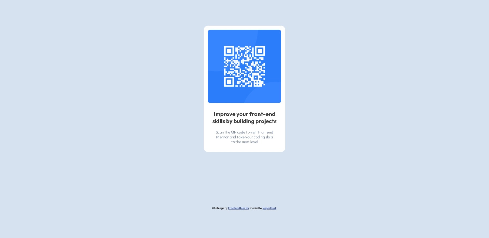

# Frontend Mentor - QR code component solution

This is a solution to the [QR code component challenge on Frontend Mentor](https://www.frontendmentor.io/challenges/qr-code-component-iux_sIO_H). Frontend Mentor challenges help you improve your coding skills by building realistic projects. 

## Table of contents

- [Overview](#overview)
  - [Screenshot](#screenshot)
  - [Links](#links)
- [My process](#my-process)
  - [Built with](#built-with)
  - [What I learned](#what-i-learned)
  - [Continued development](#continued-development)
  - [Useful resources](#useful-resources)
- [Author](#author)
- [Acknowledgments](#acknowledgments)

## Overview

### Screenshot

### Links

- Solution URL: [Add solution URL here](https://your-solution-url.com)
- Live Site URL: [Add live site URL here](https://your-live-site-url.com)

## My process

### Built with

- Semantic HTML5 markup
- CSS custom properties
- Mobile-first workflow

### What I learned

- How does CSS work with HTML
- How to make repository
- How to commit changes
- How to publish solution

### Continued development

Learn best practices and apply them
Continue to improve my HTML and CSS

### Useful resources

- (https://www.google.com/) - This helped me for every confusing and ignorence situation.

## Author

- Website - [VaporDusk](https://www.your-site.com)
- Frontend Mentor - [@vapordusk](https://www.frontendmentor.io/profile/yourusername)
- Twitter - [@vapordusk](https://www.twitter.com/yourusername)

## Acknowledgments

Thanks to the colleagues and employers from my current job for pushing me to change the job.
Thanks to my line manager from my current job for the patience.